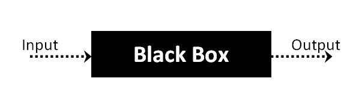

# Software Testing Fundamentals

Here you will find fundamentals of modern testing, testing from tester's and developer's
perspective, tips, techniques, strategies to do software testing, and more :]

This will definitely improve your software's quality.

### Index
-   [Intro](#intro)
-   [Black Box Testing](#Black-Box-Testing)
-   [White Box Testing](#White-Box-Testing)
-   [Black Box Testing vs White Box Testing](#Black-Box-Testing-vs-White-Box-Testing)
-   [Software Development Life Cycle](#Software-Development-Life-Cycle)
-   [Software Testing Life Cycle](#Software-Testing-Life-Cycle)

## Intro

The main reason why many users quit from using a certain software, it's because its
performance is slow, buggy, does not work on certain devices, and so on.

Testing software is just as important as developing it. In order to deliever a great UX,
make sure everything works, scale, we need to test our software.

But first, let's talk about Black Box Testing and White Box Testing.

**[⬆ Back to Index](#index)**

## Black Box Testing

Black Box Testing is a method in which the functionalities are tested without knowing
what the internal code structure, implementation details & internal paths are.

It focuses mainly on input and output of software. It is entirely based on the product
requirements and specifications.

Black Box Testing is also known as *Behavioral Testing*.

**How to do Black Box Testing**

1. Examination of the system requirements and specifications.
2. Tester chooses valid inpusts (as in a positive test scenario/use case) to
   check whether Software Under Test(SUT) processes them correctly.
3. Tester chooses invalid inputs (as in a negative test scenario/case) are chosen
   to verify that the SUT is able to detect them.
4. Tester determines expected outputs for the tested inputs.
5. Software tester constructs test cases with the selected inputs.
6. The test cases are executed.
7. Testers compares actual outputs with the expected outs.
8. Defects if any are fixed and software is re-tested.

**Types of Black Box Testing**

- Function Testing: This testing is related to the functional requirements of a 
  system; it is done by software testers.
- Non-functional Testing: This testing is related to requirements such as performance,
  scalability, usability.
- Regression Testing: This testing is done after code fixes, upgrades or any other
  system maintenance to check the new code hasn't affected the existing code.

**Black Box Testing Tools**

- Fo Functional|Regression Testing: QTP, Selenium.
- For Non-functional Testing: LoadRUnner, Jmeter.

**Black Box Testing Techniques**

- *Equivalence Class Testing*: It's used to minimize the number of possible test cases to
  an optimum level whilte maintaining reasonable testing coverage.
- *Boundary Value Testing*: It's focused on the values at boundaries. This technique
  determines whether a certain range of values are acceptable by the system or not.
- *Decision Table Testing*: A decision table puts causes and their effects in a matrix.
  There is a unique combination in each column.

**Black Box Testing and Software Development Life Cycle (SDLC)**

Black Box Testing has its own life cycle called Software Testing Life Cycle (STLC), and
it's relative to every stage of SDLC of Software Engineering.

1. Requirement: SDLC initial stage where requirements are gathered. Testers take part here.
2. Test Planning & Analysis: Testing Types applicable to the project are determined. A Test
   Plan is created in which possible risks and their mitigations are determined.
3. Design: Test cases/scripts are created based on requirement documents.
4. Testing Execution: Test Cases are executed. Bugs if any are fixed and re-tested.

**[⬆ Back to Index](#index)**

## White Box Testing

White Box Testing is a method in which internal structure, design and coding of software 
are tested to verify flow of input-output and to improve design, usability and security.

In White Box Testing, code is visible to testers so it is also called "Clear box testing",
"Open box testing", "Transparent box testing", "Code-based testing" and "Glass box testing".

This is one of two parts of the Box Testing approach to software testing. Its counterpart
Black Box Texting, involves testing from an external or end-user-type perspective.

On the other hand, White Box Testing in software engineering is based on the inner workings
of an application and revolves around internal testing.

"White Box" name symbolizes the ability to see through the software's outter shell (or "box").
While "Black Box" symbolizes not being able to see the inner structures, so that only the
end-user experience can be tested.

**What do you verify in White Box Testing?**
-  Internal security holes.
-  Broken or poorly structured paths in the coding processes.
-  The flow of specific inputs through the code.
-  Expected output.
-  The functionality of conditional loops.
-  Testing of each statement, object, and function on an individual basis.

White Box Testing can be done at system, integration and unit levels of software development. One of
the basic goals of White Box Testing is to veirfy a working flow for an app. 

It involves testing a series of predefined inputs against expected or desired outputs,
so that when a specific input does not result in the expected output, you have found a bug.

**Types of White Box Testing**

-  Unit Testing: It is often the first type of testing done on an app. Unit Testing is
   performed on each unit or block of code as it is developed. It is used done by the programmer.
   As a software developer, you develop a few lines of code, a single function or an object and test
   it to make sure it works before continuing Unit Testing helps identify a majority of bugs, early
   in the software development lifecycle. Bugs identified in this stage are cheaper and easy to fix.

-  Testing for Memory Leaks: Memory leaks are leading causes of slower running applications. A QA
   specialist who is experienced at detecting memory leaks is essential in cases where you have a
   slow running software application.

**Types of White Box and Black Box Testing (shared types of testing)**

-  White Box Penetration Testing: In this testing, the tester/developer has full information of the
   application’s source code, detailed network information, IP addresses involved and all server information
   the application runs on.  The aim is to attack the code from several angles to expose security threats.

-  White Box Mutation Testing: Mutation testing is often used to discover the best coding techniques 
   to use for expanding a software solution.

**White Box Testing Tools**

- Parasoft Jtest
- EclEmma
- NUnit
- PyUnit
- HTMLUnit
- CppUnit

**Advantages of White Box Testing**
-  Code optimization by finding hidden errors.
-  White box tests cases can be easily automated.
-  Testing is more thorough as all code paths are usually covered.
-  Testing can start early in Software Development Life Cycle (SDLC) even if the
   Graphic User Interface (GUI) is not available.

**Disadvantages of WhiteBox Testing**
-  It can be quite complex, time-consuming and expensive (depending on the App).
-  If the white box testing by developers is not detailed, it can lead to production errors.
-  It requires professional resources and a detailed understanding of programming and implementation.

**Ending Notes**
-  White Box Testing can be quite complet depending on the app being tested. It could take from a couple
   days, to weeks in order to be fully tested.
-  It should be done on a software app as it is being developed after it is written & again after each
   modification.

## Black Box Testing vs White Box Testing

*in case you didn't read the topics above, here's a summary of BBT & WBT*

**What is Black Box Testing?**

In Black-box testing, a tester doesn’t have any information about the internal working of the software system.
Black box testing is a high level of testing that focuses on the behavior of the software. It involves testing 
from an external or end-user perspective. Black box testing can be applied to virtually every level of 
software testing: unit, integration, system, and acceptance.

**What is White Box Testing?**

White-box testing is a testing technique which checks the internal functioning of the system. In this method,
testing is based on coverage of code statements, branches, paths or conditions. White-Box testing is considered
as low-level testing. It is also called glass box, transparent box, clear box or code base testing. 
The white-box Testing method assumes that the path of the logic in a unit or program is known.

**Black Box Testing and White Box Testing Differences**

<table>
  <thead>
    <tr>
      <th></th>
      <th>Black Box Testing</th>
      <th>White Box Testing</th>
    </tr>
  </thead>
  <tbody>
    <tr>
      <td>
        <strong>Definition</strong>
      </td>
      <td>It is a testing approach which is used to test the software without the knowledge of the internal structure of program or application.</td>
      <td>It is a testing approach in which internal structure is known to the tester.</td>
    </tr>
    <tr>
      <td>
        <strong>Alias</strong>
      </td>
      <td>It also knowns as data-driven, box testing, data-, and functional testing.</td>
      <td>It is also called structural testing, clear box testing, code-based testing, or glass box testing.</td>
    </tr>
    <tr>
      <td>
        <strong>Base of Testing</strong>
      </td>
      <td>Testing is based on external expectations; internal behavior of the application is unknown.</td>
      <td>Internal working is known, and the tester can test accordingly.</td>
    </tr>
    <tr>
      <td>
        <strong>Usage</strong>
      </td>
      <td>This type of testing is ideal for higher levels of testing like System Testing, Acceptance testing.</td>
      <td>Testing is best suited for a lower level of testing like Unit Testing, Integration testing.</td>
    </tr>
    <tr>
      <td>
        <strong>Programming knowledge</strong>
      </td>
      <td>Programming knowledge is not needed to perform Black Box testing.</td>
      <td>Programming knowledge is required to perform White Box testing.</td>
    </tr>
    <tr>
      <td>
        <strong>Implementation knowledge</strong>
      </td>
      <td>Implementation knowledge is not requiring doing Black Box testing.</td>
      <td>Complete understanding needs to implement WhiteBox testing.</td>
    </tr>
    <tr>
      <td>
        <strong>Automation</strong>
      </td>
      <td>Test and programmer are dependent on each other, so it is tough to automate.</td>
      <td>White Box testing is easy to automate.</td>
    </tr>
    <tr>
      <td>
        <strong>Objective</strong>
      </td>
      <td>The main objective of this testing is to check what functionality of the system under test.</td>
      <td>The main objective of White Box testing is done to check the quality of the code.</td>
    </tr>
    <tr>
      <td>
        <strong>Basis for test cases</strong>
      </td>
      <td>Testing can start after preparing requirement specification document.</td>
      <td>Testing can start after preparing for Detail design document.</td>
    </tr>
    <tr>
      <td>
        <strong>Tested by</strong>
      </td>
      <td>Performed by the end user, developer, and tester.</td>
      <td>Usually done by tester and developers.</td>
    </tr>
    <tr>
      <td>
        <strong>Granularity</strong>
      </td>
      <td>Granularity is low.</td>
      <td>Granularity is high.</td>
    </tr>
    <tr>
      <td>
        <strong>Testing method</strong>
      </td>
      <td>It is based on trial and error method.</td>
      <td>Data domain and internal boundaries can be tested.</td>
    </tr>
    <tr>
      <td>
        <strong>Time </strong>
      </td>
      <td>It is less exhaustive and time-consuming.</td>
      <td>Exhaustive and time-consuming method.</td>
    </tr>
    <tr>
      <td>
        <strong>Algorithm test</strong>
      </td>
      <td>Not the best method for algorithm testing.</td>
      <td>Best suited for algorithm testing.</td>
    </tr>
    <tr>
      <td>
        <strong>Code Access</strong>
      </td>
      <td>Code access is not required for Black Box Testing.</td>
      <td>White box testing requires code access. Thereby, the code could be stolen if testing is outsourced.</td>
    </tr>
    <tr>
      <td>
        <strong>Benefit</strong>
      </td>
      <td>Well suited and efficient for large code segments.</td>
      <td>It allows removing the extra lines of code, which can bring in hidden defects.</td>
    </tr>
    <tr>
      <td>
        <strong>Skill level</strong>
      </td>
      <td>Low skilled testers can test the application with no knowledge of the implementation of programming language or operating system.</td>
      <td>Need an expert tester with vast experience to perform white box testing.</td>
    </tr>
    <tr>
      <td>
        <strong>Techniques</strong>
      </td>
      <td>
        
Equivalence partitioning is Black box testing technique is used for Blackbox testing.

        
Equivalence partitioning divides input values into valid and invalid partitions and selecting corresponding values from each partition of the test data.
         

        
Boundary value analysis

        
checks boundaries for input values.

      </td>
      <td>
        
Statement Coverage, Branch coverage, and Path coverage are White Box testing technique.

        
Statement Coverage validates whether every line of the code is executed at least once.

        
Branch coverage validates whether each branch is executed at least once

        
Path coverage method tests all the paths of the program.

      </td>
    </tr>
    <tr>
      <td>
        <strong>Drawbacks</strong>
      </td>
      <td>Update to automation test script is essential if you to modify application frequently.</td>
      <td>Automated test cases can become useless if the code base is rapidly changing.</td>
    </tr>
  </tbody>
</table>

## Software Development Life Cycle

SDCL is a systematic process for software development. It ensures the high quality and correcteness of
the software built, for it to meet the customer expectations. The system development should be complete
in the pre-defined timeframe and cost.

It consists of a detailed plan which explains how to plan, build, and maintain specific software. Every phase 
of the SDLC life Cycle has its own process and deliverables that feed into the next phase. Software Development
Life Cycle and is also referred to as the Application Development life-cycle. 

**Why SDLC?**

-  It offers a basis for project planning, scheduling, and estimating.
-  Provides a framework for a standard set of activities and deliverables.
-  It is a mechanism for project tracking and control.
-  Increases visibility of project planning to all involved stakeholders of the development process.
-  Increased and enhanced development speed.
-  Improved client relations.
-  Helps you to decrease project risk.
-  Project management can plan overhead.

**SDLC Phases**

The entire SDLC proces divided into the following steps:

-  Phase 1: Requirement collection and analysis
-  Phase 2: Feasibility study
-  Phase 3: Design
-  Phase 4: Coding
-  Phase 5: Testing
-  Phase 6: Installation/Deployment
-  Phase 7: Maintenance

**Phase 1: Requirement collection and analysis**

This stage is conducted by the senior team members with inputs from all the stakeholders and domain experts in 
the industry. Planning for the quality assurance requirements and recognization of the risks involved 
is also done at this stage.

It gives a clearer picture of the entire project scope and the anticipated issues, opportunities, and directives
which triggered the project. This stage needs the team to get detailed and precise requirements. This helps 
companies to do an estimation on how the project timeline is going to be like.

**Phase 2: Feasibility study**

The next phase is to define and document software needs. This process is conducted with the help of the 
‘Software Requirement Specification’ document also known as ‘SRS’ document. It includes what should be designed 
and developed during the project life cycle.

There are mainly five types of feasibilities checks:

-  Economic: Can we complete the project within the budget or not?
-  Legal: Can we handle this project as cyber law and other regulatory framework/compliances.
-  Operation feasibility: Can we create operations expected by the client?
-  Technical: Check if the current computer system can support the software.
-  Schedule: Decide if the project can be completed within the given schedule or not.

**Phase 3: Design**

In this third phase, the system and software design documents are prepared as per the requirement 
specification document. This helps define overall system architecture.

This design phase serves as input for the next phase of the model.

There are two kinds of design documents developed in this phase:

High-Level Design (HLD):

-  Brief description and name of each module
-  An outline about the functionality of every module
-  Interface relationship and dependencies between modules
-  Database tables identified along with their key elements
-  Complete architecture diagrams along with technology details

Low-Level Design (LLD):

-  Functional logic of the modules
-  Database tables, which include type and size
-  Complete detail of the interface
-  Addresses all types of dependency issues
-  Listing of error messages
-  Complete input and outputs for every module

**Phase 4: Coding**

Once the system design phase is over, the next phase is coding. In this phase, developers start to build
the entire system by writing code using the chosen programming language. In the coding phase, tasks are 
divided into units or modules and assigned to the various developers. It's the longest phase of the SDLC process.

In this phase, Developer need to follow certain predefined coding guidelines. They also need to use programming 
tools like compiler, interpreters, debugger to generate and implement the code.

**Phase 5: Testing**

Once the software is complete, and it is deployed in the testing environment. The testing team starts testing
the functionality of the entire system. This is done to verify that the entire application works according 
to the customer requirement.

During this phase, QA and testing team may find some bugs/defects which they communicate to developers. The 
development team fixes the bug and send back to QA for a re-test. This process continues until the software 
is bug-free, stable, and working according to the business needs of that system.

**Phase 6: Installation/Deployment**

Once the software testing phase is over and no bugs or errors leftin the system then the final deployment 
process starts. Based on the feedback given by the project manager, the final software is released and 
checked for deployment issues if any.

**Phase 7: Maintenance**

Once the system is deployed, and customers start using the developed system, following 3 activities occur:

-  Bug fixing: bugs are reported because of some scenarios which are not tested at all
-  Upgrade: Upgrading the application to the newer versions of the Software
-  Enhancement: Adding some new features into the existing software

The main focus of this SDLC phase is to ensure that the software meets the product needs and 
the system performs as per the requirements mentioned in the first phase.

**--- Popular SDLC Models ---**

Here, are some of the most important models of SDLC:

**Waterfall model in SDLC:**

The waterfall is a widely accepted SDLC model. In this approach, the whole process of the software 
development is divided into various phases of SDLC. In this SDLC model, the outcome of one phase
acts as the input for the next phase.

This SDLC model is documentation-intensive, with earlier phases documenting what need be performed 
in the subsequent phases.

**Incremental Model in SDLC:**

The incremental model is not a separate model. It is essentially a series of waterfall cycles. 
The requirements are divided into groups at the start of the project. For each group, the SDLC model 
is followed to develop software. 

The SDLC life cycle process is repeated, with each release adding more functionality until all requirements
are met. In this method, every cycle act as the maintenance phase for the previous software release. 
Modification to the incremental model allows development cycles to overlap. After that subsequent cycle may 
begin before the previous cycle is complete.

**V-Model in SDLC:**

In this type of SDLC model, testing and development are planned in parallel. So, there are verification 
phases of the SDLC on the side and the validation phase on the other side. V-Model joins in the coding phase.

**Agile Model in SDLC:**

Agile methodology is a practice which promotes continue interaction of development and testing during the SDLC 
process of any project. In the Agile method, the entire project is divided into small incremental builds. 
All of these builds are provided in iterations, and each iteration lasts from one to three weeks.

**Spiral Model:**

The spiral model is a risk-driven process model. This SDLC testing model helps the team to adopt elements of 
one or more process models like a waterfall, incremental, waterfall, etc.

This model adopts the best features of the prototyping model and the waterfall model. The spiral methodology
is a combination of rapid prototyping and concurrency in design and development activities.

**Big bang model:**

Big bang model is focusing on all types of resources in software development and coding, with no or very 
little planning. The requirements are understood and implemented when they come.

This model works best for small projects with smaller size development team which are working together. It's 
also useful for academic software development projects. It is an ideal model where requirements is either 
unknown or final release date is not given.

**SDLC Summary**

-  The Software Development Life Cycle (SDLC) is a systematic process for building software that ensures the 
   quality and correctness of the software built.
   
-  The full form SDLC is Software Development Life Cycle or Systems Development Life Cycle.

-  SDLC in software engineering provides a framework for a standard set of activities and deliverables.

-  Seven different SDLC stages are: 
      1) Requirement collection and analysis
      2) Feasibility study: 
      3) Design
      4) Coding
      5) Testing
      6) Installation/Deployment
      7) Maintenance

-  The senior team members conduct the requirement analysis phase.

-  Feasibility Study stage includes everything which should be designed and developed during the project life cycle.

-  In the Design phase, the system and software design documents are prepared as per the requirement 
   specification document.

-  In the coding phase, developers start build the entire system by writing code using the chosen
   programming language.
   
-  Testing is the next phase which is conducted to verify that the entire application works according
   to the customer requirement.

-  Installation and deployment face begins when the software testing phase is over, and no bugs or errors
   left in the system

-  Bug fixing, upgrade, and engagement actions covered in the maintenance phase.

-  Waterfall, Incremental, Agile, V model, Spiral, Big Bang are some of the popular SDLC models.

-  SDLC in testing consists of a detailed guide that explains how to plan, build, and maintain specific software.

## Software Testing Life Cycle

Software Testing Life Cycle (STLC) is a sequence of specific activities conducted during the testing process to
ensure software quality goals are met. STLC involves both verification and validation activities. Contrary to popular
belief, Software Testing is not just a single/isolate activity. It consists of a series of activities carried out
methodologically to help certify your software product.

**STLC Phases**

There are six major phases in every Software Testing Life Cycle Model (STLC Model):

1. Requirement Analysis.
2. Test Planning.
3. Test case development.
4. Test Environment setup.
5. Test Execution.
6. Test Cycle closure.

Each of these stages have a defined Entry and Exit criteria, Activities & Deliverables associated with it.

**What is Entry and Exit Criteria in STLC?**

**-   Entry Criteria:** Entry Criteria gives the prerequisite items that must be completed before testing can begin.

**-   Exit Criteria:** Exit Criteria defines the items that must be completed before testing can be concluded.

*You have Entry and Exit Criteria for all levels in the STLC.*

In an ideal world, you will not enter the next stage until the exit criteria for the previous stage is met. But 
practically, this is not always possible.

**Requirement Phase Testing**

Requirement Phase Testing also known as Requirement Analysis is the proccess in which the team studies the
requirements from a testing point of view to identify testable requirements and the QA team may interact with
various stakeholders to understand requirements in detail. Requirements could be either functional or non-functional. 
Automation feasibility for the testing project is also done in this stage.

Activities in Requirement Phase Testing:
-  Identify types of tests to be performed.
-  Gather details about testing priorities and focus.
-  Prepare Requirement Traceability Matrix (RTM).
-  Identify test environment details where testing is supposed to be carried out.
-  Automation feasibility analysis (if required).
  
Deliverables of Requirement Phase Testing:
-  RTM
-  Automation feasibility report. (if applicable)

**Test Planning in STLC**

Test Planning in STLC is a phase in which a Senior QA manager determines the test plan strategy along with efforts
and cost estimates for the project. Moreover, the resources, test environment, test limitations and the testing
schedule are also determined. The Test Plan gets prepared and finalized in the same phase.

Test Planning Activities:
-  Preparation of test plan/strategy document for various types of testing.
-  Test tool selection.
-  Test effort estimation.
-  Resource planning and determining roles and responsibilities.
-  Training requirement.

Deliverables of Test Planning:
-  Test plan /strategy document.
-  Effort estimation document.

**Test Case Development Phase**

The Test Case Development Phase involves the creation, verification and rework of test cases & test scripts after
the test plan is ready. Initially, the Test data is identified then created and reviewed and then reworked based 
on the preconditions. Then the QA team starts the development process of test cases for individual units.

Test Case Development Activities:
-  Create test cases, automation scripts (if applicable).
-  Review and baseline test cases and scripts.
-  Create test data (If Test Environment is available).

Deliverables of Test Case Development
-  Test cases/scripts.
-  Test data.

**Test Environment Setup**

Test Environment Setup decides the software and hardware conditions under which a work product is tested. It's 
one of the critical aspects of the testing process and can be done in parallel with the Test Case Development Phase.
Test team may not be involved in this activity if the development team provides the test environment. The test team
is required to do a readiness check (smoke testing) of the given environment.

Test Environment Setup Activities:
-  Understand the required architecture, environment setup and prepare hardware & software requirement list for 
   the Test Environment.
-  Setup test Environment and test data.
-  Perform smoke test on the build.

Deliverables of Test Environment Setup:
-  Environment ready with test data setup.
-  Smoke Test Results.

**Test Execution Phase**

Test Execution Phase is carried out by the testers in which testing of the software build is done based on test
plans and test cases prepared. The process consists of test script execution, test script maintenance and bug 
reporting. If bugs are reported then it is reverted back to development team for correction and 
retesting will be performed.

Test Execution Activities:
-  Execute tests as per plan.
-  Document test results, and log defects for failed cases.
-  Map defects to test cases in RTM.
-  Retest the Defect fixes.
-  Track the defects to closure.

Deliverables of Test Execution:
-  Completed RTM with the execution status.
-  Test cases updated with results.
-  Defect reports.

**Test Cycle Closure**

Test Cycle Closure phase is completion of test execution which involves several activities like test completion
reporting, collection of test completion matrices and test results. Testing team members meet, discuss and analyze
testing artifacts to identify strategies that have to be implemented in future, taking lessons from current test 
cycle. The idea is to remove process bottlenecks for future test cycles.

Test Cycle Closure Activities:
-  Evaluate cycle completion criteria based on Time, Test coverage, Cost, Software, Critical Business Objectives, Quality.
-  Prepare test metrics based on the above parameters.
-  Document the learning out of the project.
-  Prepare Test closure report.
-  Qualitative and quantitative reporting of quality of the work product to the customer.
-  Test result analysis to find out the defect distribution by type and severity.

Deliverables of Test Cycle Closure:
-  Test Closure report.
-  Test metrics.

**STLC Phases along with Entry and Exit Criteria**

<table>
  <thead>
    <tr>
      <th>
        STLC Stage</th>
      <th>
        Entry Criteria</th>
      <th>
        Activity</th>
      <th>
        Exit Criteria</th>
      <th>
        Deliverables</th>
    </tr>
  </thead>
  <tbody>
    <tr>
      <td>
        Requirement Analysis</td>
      <td>
        <ul>
          <li>Requirements Document available (both functional and non functional)</li>
          <li>Acceptance criteria defined.</li>
          <li>Application architectural document available.</li>
        </ul>
      </td>
      <td>
        <ul>
          <li>Analyse business functionality to know the business modules and module specific functionalities.</li>
          <li>Identify all transactions in the modules.</li>
          <li>Identify all the user profiles.</li>
          <li>Gather user interface/ authentication, geographic spread requirements.</li>
          <li>Identify types of tests to be performed.</li>
          <li>Gather details about testing priorities and focus.</li>
          <li>Prepare Requirement Traceability Matrix (RTM).</li>
          <li>Identify test environment details where testing is supposed to be carried out.</li>
          <li>Automation feasibility analysis (if required).</li>
        </ul>
      </td>
      <td>
        <ul>
          <li>Signed off RTM</li>
          <li>Test automation feasibility report signed off by the client</li>
        </ul>
      </td>
      <td>
        <ul>
          <li>RTM</li>
          <li>Automation feasibility report (if applicable)</li>
        </ul>
      </td>
    </tr>
    <tr>
      <td> Test Planning</td>
      <td>
        <ul>
          <li>Requirements Documents</li>
          <li>Requirement Traceability matrix.</li>
          <li>Test automation feasibility document.</li>
        </ul>
      </td>
      <td>
        <ul>
          <li>Analyze various testing approaches available</li>
          <li>Finalize on the best-suited approach</li>
          <li>Preparation of test plan/strategy document for various types of testing</li>
          <li>Test tool selection</li>
          <li>Test effort estimation</li>
          <li>Resource planning and determining roles and responsibilities.</li>
        </ul>
      </td>
      <td>
        <ul>
          <li>Approved test plan/strategy document.</li>
          <li>Effort estimation document signed off.</li>
        </ul>
      </td>
      <td>
        <ul>
          <li>Test plan/strategy document.</li>
          <li>Effort estimation document.</li>
        </ul>
      </td>
    </tr>
    <tr>
      <td> Test case development</td>
      <td>
        <ul>
          <li>Requirements Documents</li>
          <li>RTM and test plan</li>
          <li>Automation analysis report</li>
        </ul>
      </td>
      <td>
        <ul>
          <li>Create test cases, test design, automation scripts (where applicable)</li>
          <li>Review and baseline test cases and scripts</li>
          <li>Create test data</li>
        </ul>
      </td>
      <td>
        <ul>
          <li>Reviewed and signed test Cases/scripts</li>
          <li>Reviewed and signed test data</li>
        </ul>
      </td>
      <td>
        <ul>
          <li>Test cases/scripts</li>
          <li>Test data</li>
        </ul>
      </td>
    </tr>
    <tr>
      <td> Test Environment setup</td>
      <td>
        <ul>
          <li>System Design and architecture documents are available</li>
          <li>Environment set-up plan is available</li>
        </ul>
      </td>
      <td>
        <ul>
          <li>Understand the required architecture, environment set-up</li>
          <li>Prepare hardware and software development requirement list</li>
          <li>Finalize connectivity requirements</li>
          <li>Prepare environment setup checklist</li>
          <li>Setup test Environment and test data</li>
          <li>Perform smoke test on the build</li>
          <li>Accept/reject the build depending on smoke test result</li>
        </ul>
      </td>
      <td>
        <ul>
          <li>Environment setup is working as per the plan and checklist</li>
          <li>Test data setup is complete</li>
          <li>Smoke test is successful</li>
        </ul>
      </td>
      <td>
        <ul>
          <li>Environment ready with test data set up</li>
          <li>Smoke Test Results.</li>
        </ul>
      </td>
    </tr>
    <tr>
      <td> Test Execution</td>
      <td>
        <ul>
          <li>Baselined RTM, Test Plan, Test case/scripts are available</li>
          <li>Test environment is ready</li>
          <li>Test data set up is done</li>
          <li>Unit/Integration test report for the build to be tested is available</li>
        </ul>
      </td>
      <td>
        <ul>
          <li>Execute tests as per plan</li>
          <li>Document test results, and log defects for failed cases</li>
          <li>Update test plans/test cases, if necessary</li>
          <li>Map defects to test cases in RTM</li>
          <li>Retest the defect fixes</li>
          <li>Regression Testing of application</li>
          <li>Track the defects to closure</li>
        </ul>
      </td>
      <td>
        <ul>
          <li>All tests planned are executed</li>
          <li>Defects logged and tracked to closure</li>
        </ul>
      </td>
      <td>
        <ul>
          <li>Completed RTM with execution status</li>
          <li>Test cases updated with results</li>
          <li>Defect reports</li>
        </ul>
      </td>
    </tr>
    <tr>
      <td>
        Test Cycle closure</td>
      <td>
        <ul>
          <li>Testing has been completed</li>
          <li>Test results are available</li>
          <li>Defect logs are available</li>
        </ul>
      </td>
      <td>
        <ul>
          <li>Evaluate cycle completion criteria based on &#8211; Time, Test coverage, Cost, Software Quality, Critical Business Objectives</li>
          <li>Prepare test metrics based on the above parameters.</li>
          <li>Document the learning out of the project</li>
          <li>Prepare Test closure report</li>
          <li>Qualitative and quantitative reporting of quality of the work product to the customer.</li>
          <li>Test result analysis to find out the defect distribution by type and severity</li>
        </ul>
      </td>
      <td>
        <ul>
          <li>Test Closure report signed off by client</li>
        </ul>
      </td>
      <td>
        <ul>
          <li>Test Closure report</li>
          <li>Test metrics</li>
        </ul>
      </td>
    </tr>
  </tbody>
</table>

**[⬆ Back to Index](#index)**
